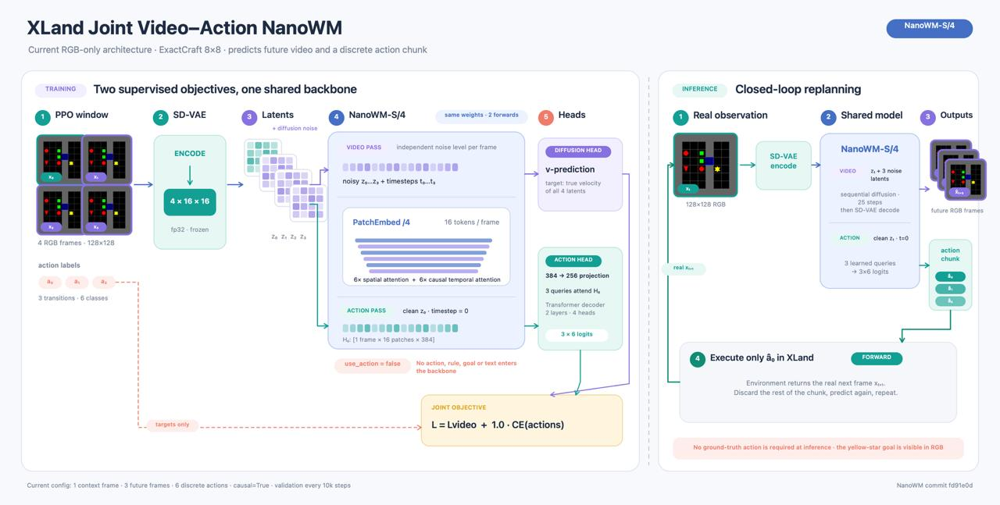
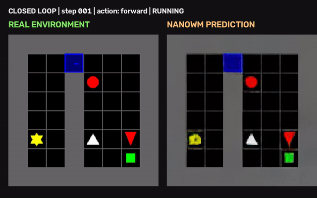
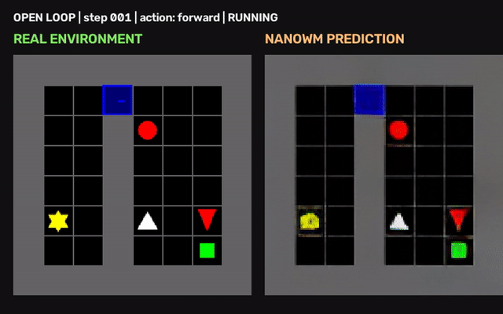

# XLand Joint Video–Action NanoWM

A controlled research project for studying **World Action Models (WAMs)** in
[XLand-MiniGrid](https://github.com/dunnolab/xland-minigrid). The model receives
RGB observations from a procedural crafting grid world and jointly learns to
predict future visual states and a short chunk of discrete actions.

*Implemented XLand Joint Video–Action NanoWM. A frozen SD-VAE encodes a
four-frame PPO trajectory window. A shared NanoWM-S/4 backbone supports a
diffusion video objective and a transformer action head. At inference, only the
first action of each predicted chunk is executed, XLand returns the real
observation, and the model replans.*

## Closed-loop versus open-loop rollout

The GIFs visualise two ways of running the same learned world-action model.

| Closed loop: real environment feedback | Open loop: world-model feedback |
|---|---|
|  |  |

*Left: after every executed action, XLand returns the real next RGB observation;
the model replans from this ground-truth state. Right: the next frame predicted
by the world model is fed back as the next model input. The open-loop rollout
therefore directly visualises how world-model prediction errors compound over
time.*

## Research questions

1. **Diversity of pretraining data:** how do trajectory volume and pretraining
   on related dynamics affect OOD policy quality?
2. **Failed and random trajectories:** can non-expert trajectories improve the
   world model without degrading action learning?
3. **Small-scale scaling laws:** do model size and data volume improve OOD
   generalisation?
4. **Memorisation or rule learning:** does the model transfer rules across
   unseen colour--shape bindings and unseen task trees?
5. **Training objective:** when does the joint video+action objective help
   relative to action-only training?

## Environment and protocol

ExactCraft-Easy renders an 8×8 world at 128×128 RGB. The agent has six
discrete actions and must craft a blue key, open a door, and reach the goal.
The task bank contains nine two-rule dependency trees: six are used for
training and three complete trees are held out for OOD evaluation. Every
primitive rule appears in both splits; only rule combinations are unseen.

Training examples are successful PPO trajectories. Each sample is a four-frame
window, therefore contains three state transitions and three action labels.

The primary metric is **closed-loop success rate (SR)**. The model predicts an
action chunk, XLand executes only its first action, returns the real next
observation, and the model replans. We report both:

- **T=0:** greedy action selection;
- **T=1:** sampling from the predicted softmax distribution.

This distinction is important: greedy policies can repeat an unproductive
action sequence in the partially observed environment.

## Architecture

The implementation follows NanoWM with an action-conditioned extension.

- **Visual encoder:** frozen SD-VAE, run in fp32.
- **Latents:** each 128×128 frame becomes a 4×16×16 spatial latent.
- **Backbone:** NanoWM-S/4 tokenises the latent grid into 16 tokens per frame
  and shares its transformer representation between video and action learning.
- **Video head:** diffusion prediction of future latents (v-prediction,
  cosine schedule, **1,000 training timesteps**). Visual future-frame samples
  use **25 denoising steps** at evaluation, not 1,000.
- **Action inference:** the action head reads the clean latent at t=0 directly;
  closed-loop action selection does not run a 25-step video sampling loop.
- **Action head:** three learned action queries attend to the NanoWM
  representation, then a two-layer, four-head transformer decoder and an MLP
  produce 3×6 action logits.
- **Objectives:** Video + action jointly optimises diffusion loss and action
  cross-entropy; Action-only disables the video loss while retaining the same
  backbone and action head.

## Repository layout

- **src/collect_xland_ppo.py** — collects successful PPO rollouts into NPZ
  trajectory files.
- **src/resize_xland_dataset.py** — converts trajectory frames to 128×128.
- **src/xland_action_server.py** — serves NanoWM action predictions to the
  closed-loop evaluator through a Unix socket.
- **src/evaluate_xland_closed_loop.py** — executes real XLand rollouts and logs SR.
- **src/nanowm_xland*.patch** — patches for the NanoWM repository.
- **src/launch_collection.sh** — example multi-worker PPO collection.
- **bin/run_train_128.sh** — baseline 128px NanoWM training launch.
- **bin/watch_closed_loop_eval.sh** — evaluates newly saved checkpoints.
- **bin/run_tensorboard.sh** — starts TensorBoard for a run.

Datasets, checkpoints, TensorBoard event files, videos, and generated plots are
deliberately excluded from Git.

## Setup

The repository expects two external source repositories:

~~~
export ROOT=$PWD
mkdir -p repos
git clone https://github.com/hyung-hwan/nano-world-model.git repos/nano-world-model
git clone https://github.com/dunnolab/xland-minigrid.git repos/xland-minigrid-five-object
~~~

Apply the NanoWM patch appropriate for the version you cloned, then create the
environments:

~~~
export ROOT=$PWD
bash bin/prepare_envs.sh
~~~

The setup helper is server-oriented. Review and override ROOT, NANOWM_ENV,
XLAND_ENV, and GPU-related variables before running it. It installs dependencies;
do not run it blindly in a shared environment.

## Data collection

A collector stores one episode per compressed NPZ file. The expected layout is:

~~~
data/
└── exactcraft_easy_10k_128/
    ├── train/
    │   └── shard_*/
    │       └── episode_train_*.npz
    └── val/
        └── shard_*/
            └── episode_val_*.npz
~~~

The supplied collection launcher is a reproducible example for collecting
9,000 train and 1,000 validation PPO trajectories. Update its explicit
checkpoint and path variables for your machine.

## Training

The baseline launcher trains NanoWM-S/4 on 128px trajectories:

~~~
export ROOT=$PWD
export DATASET_ROOT=$ROOT/data
export RESULTS_ROOT=$ROOT/runs
export RUN_NAME=exactcraft_s4_video_action
export GPU=0
bash bin/run_train_128.sh
~~~

The launcher checks that the dataset exists and refuses to overwrite an existing
run directory. Default training uses batch size 8, learning rate 1e-4, weight
decay 0.01, warmup 500 steps, fp16 model precision, and fp32 VAE precision.

## Closed-loop evaluation

Start the watcher after a training run. It finds saved checkpoints, starts the
action server on the chosen GPU, and runs the XLand evaluator:

~~~
export ROOT=$PWD
export RUN_NAME=exactcraft_s4_video_action
export ACTION_GPU=0
export EVAL_EPISODES=30
bash bin/watch_closed_loop_eval.sh
~~~

Evaluation artifacts are written below:

~~~
runs/<RUN_NAME>/
├── closed_loop_eval/
├── closed_loop_tb/
└── closed_loop_logs/
~~~

Launch TensorBoard with:

~~~
export ROOT=$PWD
export RUN_NAME=exactcraft_s4_video_action
bash bin/run_tensorboard.sh
~~~

## Reproducibility notes

- Keep train and OOD task trees disjoint.
- Evaluate in closed loop; teacher-forced action accuracy is not policy success.
- Log decoding temperature together with SR.
- Compare Video + action and Action-only at identical model size, data,
  training steps, and evaluation seeds.
- For a scaling claim, use the same training budget and enough evaluation
  episodes for every dataset size.

## Citation

If you use this code, cite NanoWM and XLand-MiniGrid.

~~~bibtex
@article{huang2026nanowm,
  title={Nano World Models: A Minimalist Implementation of Future Video Prediction},
  author={Huang et al.},
  year={2026}
}

@inproceedings{nikulin2024xland,
  title={XLand-MiniGrid: Scalable Meta-RL Environments in JAX},
  author={Nikulin et al.},
  booktitle={NeurIPS Datasets and Benchmarks},
  year={2024}
}
~~~
